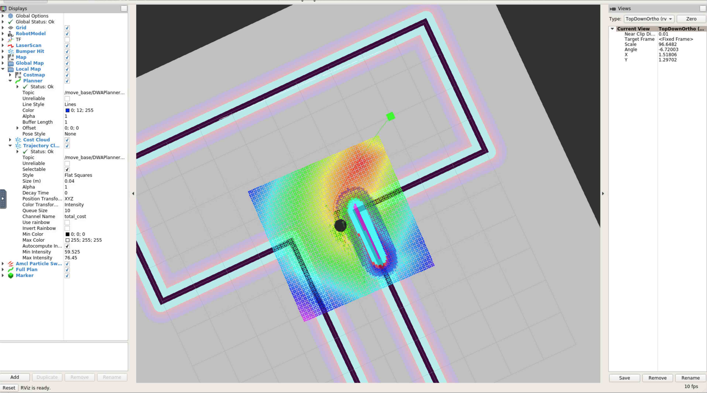

# Udacity Robotics Nanodegree
# Project #5: Home Service Robot



## Introduction
This is a project for Udacity's Robotics NanoDegree. It's a home service robot capable of executing simultaneous localization and mapping (SLAM), as well as navigating to waypoints to pickup/deliver objects.

## Concepts and Classes
Concepts explored in this project:

  - Simultaneous Localization and Mapping (SLAM)
  - global and local costmaps
  - navigation and path finding
  - ROS turtlebot and gmapping packages

## Getting Started
To view this project, you must have Gazebo and ROS installed on Linux.

[Click here for Gazebo download and installation instructions](http://gazebosim.org).

[Click here for ROS installation instructions](http://wiki.ros.org/ROS/Installation).

To begin, make sure all relevant packages are up-to-date:

```
$ sudo apt-get update && sudo apt-get upgrade -y
```

Next, clone the repository:

```
$ git clone --recurse-submodules https://github.com/timmyneutron/RoboticsND-Home-Service-Robot.git
```

Then navigate up to the root level directory, and execute:

```
$ catkin_make
$ source devel/setup.bash
```

And navigate to the ```scripts``` directory:

```
$ cd src/scripts
```

## Part 1: SLAM
The first thing the robot can do is simultaneous localization and mapping (SLAM). To perform SLAM, run the ```test_slam.sh``` script:

```
$ ./test_slam.sh
```

Several windows will automatically open (this may take a few seconds). You will see the robot in Rviz in what looks like a fairly blank map. To operate the robot, click on the window for the ```keyboard_teleop``` node, and follow the commands there. As the robot moves around the world, the map will begin to appear in Rviz.

## Part 2: Navigation
The next task for the robot is navigation. To test the robot's navigation capabilities, run the ```test_navigation.sh``` script:

```
$ ./test_navigation.sh
```

Again, several windows will open (this may take a few seconds). This time you'll see the robot in a completed map in Rviz. Click the "2D Nav Goal" button and click/drag somewhere on the map to command the robot. The robot will find a path to the goal location and follow it.

## Part 3: Full Service
Now that the world is mapped and the robot can follow commands, the robot can be instructed to pick up and drop off a simulated object at different waypoints. To do this, run the ```home_service.sh``` script:

```
$ ./home_service.sh
```

An item (represented by a green cube) will show up in Rviz. The robot will navigate to the item, at which point it will disappear (indicating it has been picked up), and then the robot will navigate to another point and drop off the item, at which point the item will reappear.